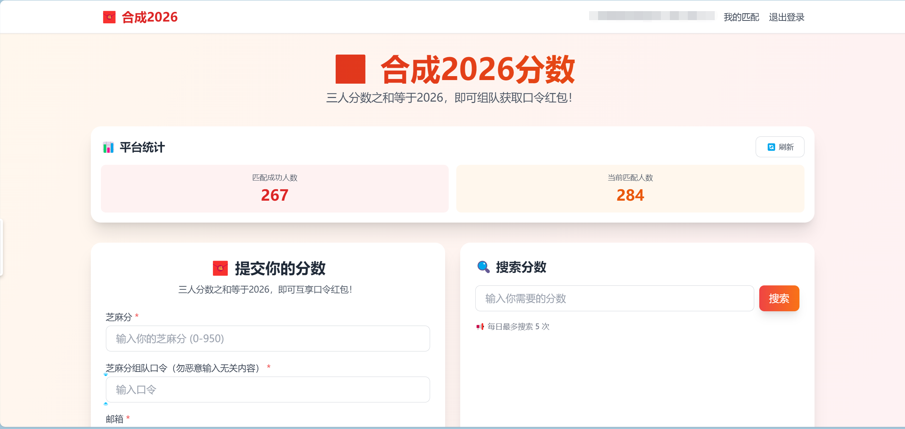

# 🧧 合成2026分数 - 芝麻分组队匹配

三人分数之和等于2026，即可互享芝麻宝口令红包！



## 技术栈

- **前端**: Vue 3 + Vite + TailwindCSS
- **后端**: Supabase (数据库 + 认证 + Edge Functions)
- **状态管理**: Pinia

## 功能特性

- ✅ 用户注册/登录
- ✅ 提交芝麻分和口令
- ✅ 自动三数之和匹配 (总和=2026)
- ✅ 搜索特定分数
- ✅ 匹配成功邮件通知
- ✅ 举报失效口令
- ✅ 优先匹配800+分数
- ✅ 支持多组匹配

## 快速开始

### 1. 安装依赖

```bash
npm install
```

### 2. 配置 Supabase

1. 在 [Supabase](https://supabase.com) 创建新项目
2. 复制 `.env.example` 为 `.env`
3. 填入你的 Supabase 配置信息

```env
VITE_SUPABASE_URL=your_supabase_project_url
VITE_SUPABASE_ANON_KEY=your_supabase_anon_key
```

### 3. 初始化数据库

在 Supabase SQL Editor 中执行 `supabase/schema.sql` 中的 SQL 语句

### 4. 部署 Edge Function

```bash
cd supabase/functions/match-scores
supabase functions deploy match-scores
```

### 5. 运行开发服务器

```bash
npm run dev
```

## 数据库结构

- `scores` - 分数表（存储用户提交的分数和口令）
- `matches` - 匹配记录表
- `reports` - 举报表

## 项目结构

```
src/
├── components/          # Vue 组件
│   ├── LoginForm.vue
│   ├── RegisterForm.vue
│   ├── ScoreSubmit.vue
│   ├── MatchList.vue
│   └── SearchScore.vue
├── stores/             # Pinia 状态管理
│   └── auth.js
├── lib/                # 工具库
│   └── supabase.js
├── views/              # 页面视图
│   ├── Home.vue
│   └── MyMatches.vue
├── router/             # 路由配置
│   └── index.js
├── App.vue
└── main.js
```

## License

MIT
